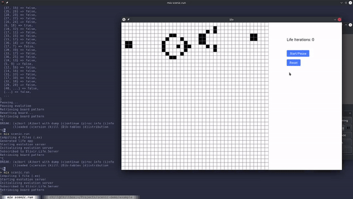
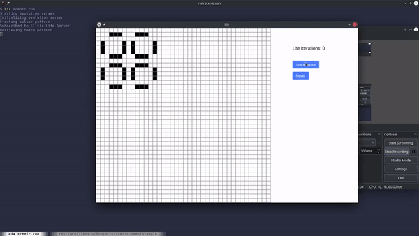

# Life

[Conway's Game of Life](https://en.wikipedia.org/wiki/Conway%27s_Game_of_Life) visualizer tool built with
[Elixir](https://elixir-lang.org/) and [Scenic.](https://github.com/boydm/scenic)

## Sample

Flyer Generator



Pulsar Oscillator



## Explanation

In the Game of Life, a board has cells that are either alive or dead. Given a set of rules, the board will change. All
changes for a given iteration/tick happen simultaneously on the previous board status. This means that any changes to
the cells during the current iteration will be influence the other cells.

## Rules

The rules of Conway's Game of Life are very simple,

1. any live cell with two or three live neighbors remain alive,
2. any live cell with fewer than two live neighbors dies (simulating underpopulation),
3. any live cell with greater than three live neighbors dies (simulating overpopulation),
4. any dead cell with exactly three live neighbors become a live cell (simulating reproduction)

## Using the visulizer

**Important** Unfortunately, due to limitations of Scenic, the visualizer can only run on Mac OS and Linux.

Ensure that Elixir and any [dependency of Scenic](https://hexdocs.pm/scenic/install_dependencies.html) is installed.

```bash
git clone https://github.com/woojiahao/life.git
cd life/
mix deps.get
mix scenic.run
```

Select the cells to set them as alive/dead before running.

## Configuration

You can configure the board size and initial pattern by editing the `config/attrs.exs` file, under the `:attrs` config.

```elixir
import Config

# Configure here
config :life, :attrs, %{
  cell_size: 20,
  evolution_rate: 100,
  pattern: :empty
}
```

1. `cell_size` -- size of each cell displayed
2. `evolution_rate` -- speed each iteration occurs, measured in milliseconds
3. `pattern` -- some default oscillating patterns to get started, includes `:blinker`, `:beacon`, `:pulsar`, `:toad`, `:empty`
